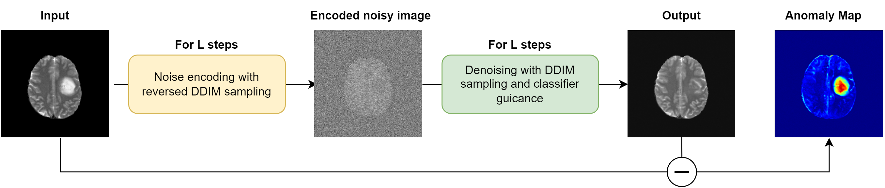

# 条件付き拡散モデルの弱教師あり学習による脳腫瘍領域セグメンテーション

伊藤の修論内容についてのリポジトリ.
条件付き拡散モデルの弱教師あり学習を行い, 医療データ内の異常領域を検出した先行研究["Diffusion Models for Medical Anomaly Detection"](https://arxiv.org/abs/2203.04306)を元に, 異常領域のセグメンテーションを達成することを試みる.

先行研究のプログラムは[diffusion-anomaly](https://gitlab.com/cian.unibas.ch/diffusion-anomaly)や[openai/guided-diffusion](https://github.com/openai/guided-diffusion)を参照し, [guided_diffusion](./guided_diffusion/)フォルダ内に記載. 実験や検証に用いたプログラムは[scripts](./scripts/)内に記載. 詳細は各フォルダ内の README を参照.



## Data

-   [ ] インストール方法の説明 [BRATS2020 dataset](https://www.med.upenn.edu/cbica/brats2020/data.html)

-   [ ] データについての詳細説明(データ数, データサイズ, チャネル数など)

-   [ ] NifTi 形式の読み込み方についても説明

## Usage

We set the flags as follows:

```
MODEL_FLAGS="--image_size 256 --num_channels 128 --class_cond True --num_res_blocks 2 --num_heads 1 --learn_sigma True --use_scale_shift_norm False --attention_resolutions 16"
DIFFUSION_FLAGS="--diffusion_steps 1000 --noise_schedule linear --rescale_learned_sigmas False --rescale_timesteps False"
TRAIN_FLAGS="--lr 1e-4 --batch_size 10"
CLASSIFIER_FLAGS="--image_size 256 --classifier_attention_resolutions 32,16,8 --classifier_depth 4 --classifier_width 32 --classifier_pool attention --classifier_resblock_updown True --classifier_use_scale_shift_norm True"
SAMPLE_FLAGS="--batch_size 1 --num_samples 1 --timestep_respacing ddim1000 --use_ddim True"
```

To train the classification model, run

```
python scripts/classifier_train.py --data_dir path_to_traindata --dataset brats_or_chexpert $TRAIN_FLAGS $CLASSIFIER_FLAGS
```

To train the diffusion model, run

```
python scripts/image_train.py --data_dir --data_dir path_to_traindata --datasaet brats_or_chexpert  $MODEL_FLAGS $DIFFUSION_FLAGS $TRAIN_FLAGS
```

The model will be saved in the _results_ folder.

For image-to-image translation to a healthy subject on the test set, run

```
python scripts/classifier_sample_known.py  --data_dir path_to_testdata  --model_path ./results/model.pt --classifier_path ./results/classifier.pt --dataset brats_or_chexpert --classifier_scale 100 --noise_level 500 $MODEL_FLAGS $DIFFUSION_FLAGS $CLASSIFIER_FLAGS  $SAMPLE_FLAGS
```

A visualization of the sampling process is done using [Visdom](https://github.com/fossasia/visdom).
